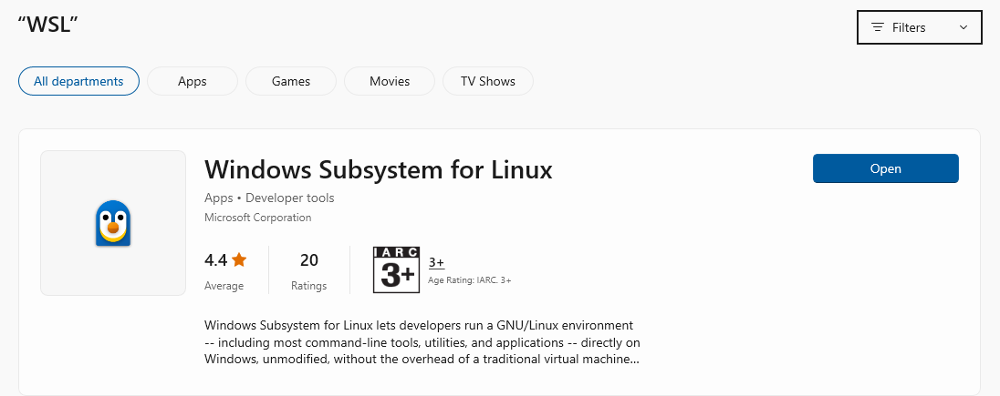
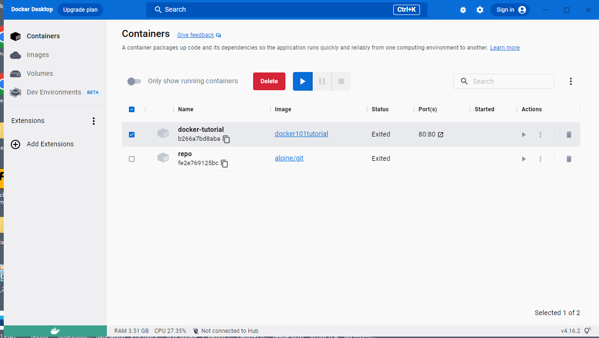
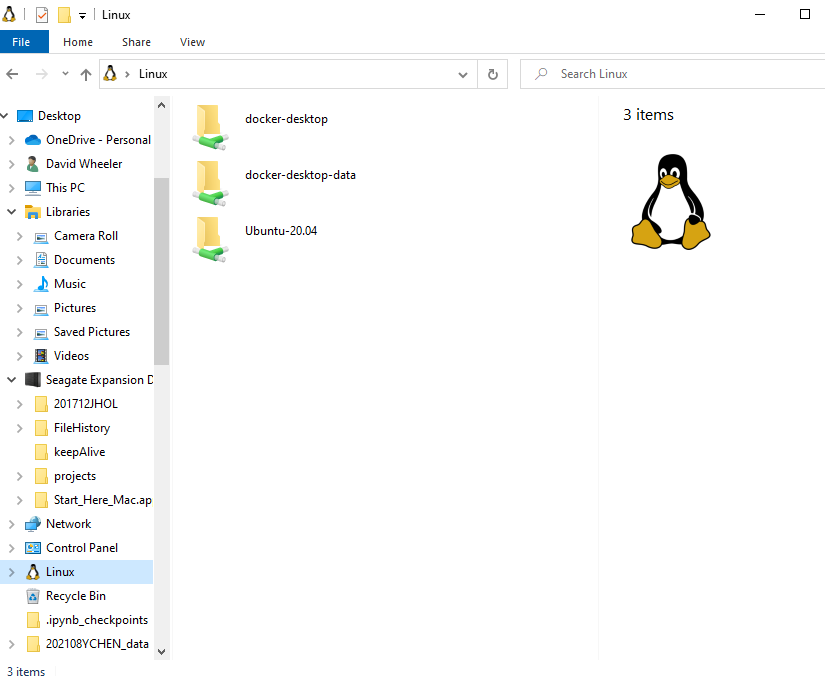
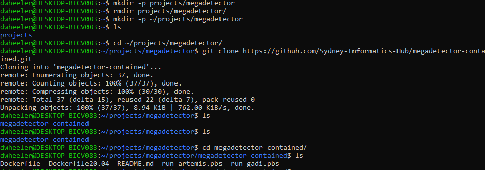
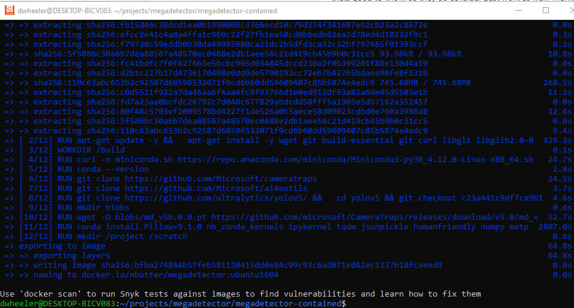

# 202302lgonsalves  

# Introduction  
Installing and running megadetector (V5) in a docker invironment on windows.  

# Acknowledgements  
If you use this code please acknowledge the original authors from the Sydney University Informatics Hub, as per their note below from the original repo.

**If you have used this work for a publication, you must acknowledge SIH, e.g: "The authors acknowledge the technical assistance provided by the Sydney Informatics Hub, a Core Research Facility of the University of Sydney."**

# Megadetector repo source   
https://github.com/Sydney-Informatics-Hub/megadetector-contained

# Instructions  

## Install WSL using the windows store    
1. Install Windows Subsystem for Linux (WSLv2) using the windows app store  
2. Type 'store' in the windows search box and select 'Microsoft store'
3. In the search bar at the top of the store search for 'WSL'



- Install the app and then **reboot your computer**

## Install Ubuntu linux using WSL  
1. Once again in the windows store search for 'Ubuntu 20.04 LTS' and install the app (at the time of writing the current version is 20.04.5)  

  

2. Launch the Ubuntu app using the start menu, you will be asked for a username and password
3. Apply updates by typing the following:  
```
sudo apt update && sudo apt upgrade -y
```

  

4. Shutdown the app by closing the window (or typing `exit`)  

## Install docker desktop for windows  
1. Navigate to `www.docker.com/products/docker-desktop/` and click the Download Docker Desktop for windows button  
2. Install the application selecting `WSL` as the backend  
3. Check that everything is working by opening the `Docker Desktop` app from the start menu  

  

# QuickStart: Megadetetor from the docker hub
This is the quick start way of getting megadetector up and running using the docker hub version. This requires setting up a free account and then downloading the docker image that has been build via the team at Sydney Universities Inforatics Hub. An alternative option is to build it from the repo (This is further down the page if you are intested). To install from the hub you will need a docker hub account.  

## Create a free account on docker hub
1. Navigate to `hub.docker.com` and create a free account  
2. After creating your account an option will be available to connect to docker desktop (otherwise just login directly using the docker desktop app)  
3. In the search menu type `nbutter/megadetector` and click `pull`

    

Hopefully that is all that is required. Note I have included more advanced instructions below in case you want to build the app from source (this is not required if the above has worked for you).  

# Process camera trap images through megadetector (with GPU support)  
1. Open the Ubuntu App and create a place to store your images (**replace PROJECTNAME with your own meaningful name of your own (please dont use spaces, use an underscore instead, every linux user will thank you)**)

```
# replace PROJECTNAME with your own name (Don't use spaces!!)
mkdir -p ~/projects/PROJECTNAME
```

2. Copy your image files to the Ubuntu disk are using file explorer (see the figures below): in the linux disk your directory path would be `/home/USERNAME/projects/PROJECTNAME`  

  


You can copy directories with sub-directories if you like, the command we will use to run megadetector will look through all folders in the target directory.  

3. Check that your images copied across by typing the following in the Ubuntu app terminal
```
# replace PREJECTDIRECTORY with the name you used
cd ~/projects/PROJECTDIRECTORY
# this should print out files
ls
```

4. Run megadetector using the command line options to test the installation (will ask you for your password). Note the use of the `-h` flag here, this will print out the help, that will show all the possible options for running megadetector.    

NOTE: Everything below with `#` is just info that will be printed to your linux terminal window, please don't type anything with the hash as they are just comments.  

```
sudo docker run --gpus all -it -v `pwd`:/project nbutter/megadetector:ubuntu1604 /bin/bash -c "cd /project && python /build/cameratraps/detection/run_detector.py -h"

#usage: run_detector.py [-h] (--image_file IMAGE_FILE | --image_dir IMAGE_DIR) [--recursive] [--output_dir OUTPUT_DIR]
#                       [--image_size IMAGE_SIZE] [--threshold THRESHOLD] [--crop] [--box_thickness BOX_THICKNESS]
#                       [--box_expansion BOX_EXPANSION]
#                       detector_file
#
#Module to run an animal detection model on images
#
#positional arguments:
#  detector_file         Path to TensorFlow (.pb) or PyTorch (.pt) detector model file
#
#optional arguments:
#  -h, --help            show this help message and exit
#  --image_file IMAGE_FILE
#                        Single file to process, mutually exclusive with --image_dir
#  --image_dir IMAGE_DIR
#                        Directory to search for images, with optional recursion by adding --recursive
#  --recursive           Recurse into directories, only meaningful if using --image_dir
#  --output_dir OUTPUT_DIR
#                        Directory for output images (defaults to same as input)
#  --image_size IMAGE_SIZE
#                        Force image resizing to a (square) integer size (not recommended to change this)
#  --threshold THRESHOLD
#                        Confidence threshold between 0 and 1.0; only render boxes above this confidence (defaults to
#                        0.2)
#  --crop                If set, produces separate output images for each crop, rather than adding bounding boxes to
#                        the original image
#  --box_thickness BOX_THICKNESS
#                        Line width (in pixels) for box rendering (defaults to 4)
#  --box_expansion BOX_EXPANSION
#                        Number of pixels to expand boxes by (defaults to 0)
```

5. Nowe can use the above information to run megadetector so that it will (see above output for all command line options):  
a) processes all images (and sub-folders via `--recursive`) in the directory called `TP`  
b) creates output directory called `testing` containing images with boundary boxes around animal detections    
c) only draws boxes when detection probability is greater than 20%  

You can modify the command below based on the above to match your filenames/folders etc.  

**Note:** If you don't have a GPU (graphics card), then don't include the `--gpus all` part.    

```
sudo docker run --gpus all -it -v `pwd`:/project nbutter/megadetector:ubuntu1604 /bin/bash -c "cd /project && python /build/cameratraps/detection/run_detector.py /build/blobs/md_v5b.0.0.pt --image_dir ./TP --output_dir ./testing --threshold 0.2 --recursive"
```

Hopefully you can see that by changing the above command you can alter what images are processed, the detection threshold, and the output location.
  

6. Or you can run in batch mode if you want to do downstream processing like removing empty images based on an ouput summary file that shows filenames and detection probabilities etc.  

**Note:** This mode won't create images with boundary boxes, it simply creates a JSON outfile. The advantage of this mode is that it saves disk space because output images are not being created. Note that you can still create these images latter using information contained in the JSON output file. You can also you use this file to filter out empty images etc (just get in touch if you have any questions about this).  

This command will:
b) create a JSON file of outputs called `TP.json`  
c) only include detections above 20% probability  
d) save the output file every 1000 images (in case of crash etc)

```
sudo docker run --gpus all -it -v `pwd`:/project nbutter/megadetector:ubuntu1604 /bin/bash -c "cd /project && python /build/cameratraps/detection/run_detector_batch.py /build/blobs/md_v5b.0.0.pt ./TP TP.json --output_relative_filenames --recursive --threshold 0.2 --checkpoint_frequency 1000"
```

## Accessing the output files  
The commands above use your current working directory as a root directory, so any output files that are generated should be viewable in file explorer if you navigate to your linux disk space. You can copy these across. If you want a more user friendly version of JSON see the tools directory which has a script for converting JSON to CSV format that will open in excel.  


# Advanced: Building the megadetector image from the repo   
The following instructions will build the docker image from the original repo. This is a little more advanced and will take around 30 minutes to install and download ~10GB from the internet.  

## Install the Sydney Uni Megadetector v5 using Ubuntu  
1. Open the Ubuntu app again from the start menu  
2. Check that docker works by typing:  
```
docker -h
```


3. Create a place to store the megadetector code and clone the repo  
```
# make a directory to storet the project (tildre is your home directory)
mkdir -p ~/projects/megadetector
# change into this new directory
cd ~/projects/megadetector
# clone the repo
git clone https://github.com/Sydney-Informatics-Hub/megadetector-contained.git
# change into the repo directory
cd megadetector-contained
# check the files available
ls
```



4. Build the docker image (this will take some time and download a significant portion of the entire internet (-;)   
```
# will ask you for your password
sudo docker build . -t nbutter/megadetector:ubuntu1604
```



## Check the image using the docker desktop app  
1. If the docker desktop app is closed open it now using the start menu  
2. If step 4 above was successful then you should see the new megadetector image agailable in the desktop app (click images) 


3. To run the app as described in the fast start section

# Tools  
- convert JSON to CSV format - xxxx.py  
